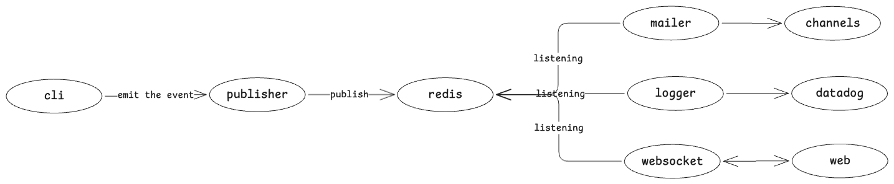

# proof-of-concepts

This repository contains a collection of proof-of-concepts for various technologies and concepts.

## Languages

- golang
- typescript

## Concepts and Technologies

- pub/sub
- redis
- docker networking
- event-driven
- microservices
- websockets
- datadog
- channels and routines

## Services

### publisher

A simple publisher service that sends messages to a redis pub/sub channel.

### logger

A simple logger service that listens for log messages, prints them to the console, and forwards them to a datadog agent.

### mailer

A simple mailer service that listens for mail messages and sends them to a mail server using channels and routines.

### websockets

A simple websockets service that listens for messages and broadcasts them to all connected clients.

### web

A simple web app that serves a static web page and listens for messages from the websockets service.

### cli

A simple command line interface that sends messages to the publisher service.
